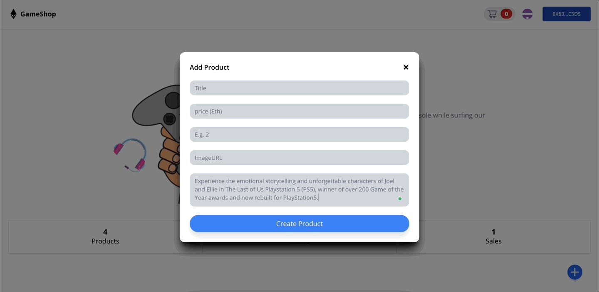

# A Fantastic Web3 Game Sales Shop with React and Solidity

This example shows How to Build a Fantastic Web3 Game Sales Shop with React and Solidity:


<center><figcaption>Game Products</figcaption></center>



<center><figcaption>Add Product</figcaption></center>


<center><figcaption>Cancel Orders</figcaption></center>


<center><figcaption>Placing Orders</figcaption></center>

## Technology

This demo uses:

- Metamask
- Hardhat
- Alchamy
- ReactJs
- Tailwind CSS
- Solidity
- EthersJs
- Faucet

## Running the demo

To run the demo follow these steps:

1. Clone the project with the code below.

   ```sh

   # Make sure you have the above prerequisites installed already!
   git clone https://github.com/BlessingAdebayo/Solidity-Xplorer-project.git
   cd gameShop # Navigate to the new folder.
   yarn install # Installs all the dependencies.
   ```

2. Create an Alchemy project, copy and paste your key in the spaces below.
3. Update the `.env` file with the following details.

   ```sh
   ENDPOINT_URL=<PROVIDER_URL>
   DEPLOYER_KEY=<YOUR_PRIVATE_KEY>
   ```

4. Run the app using `yarn start`
  
